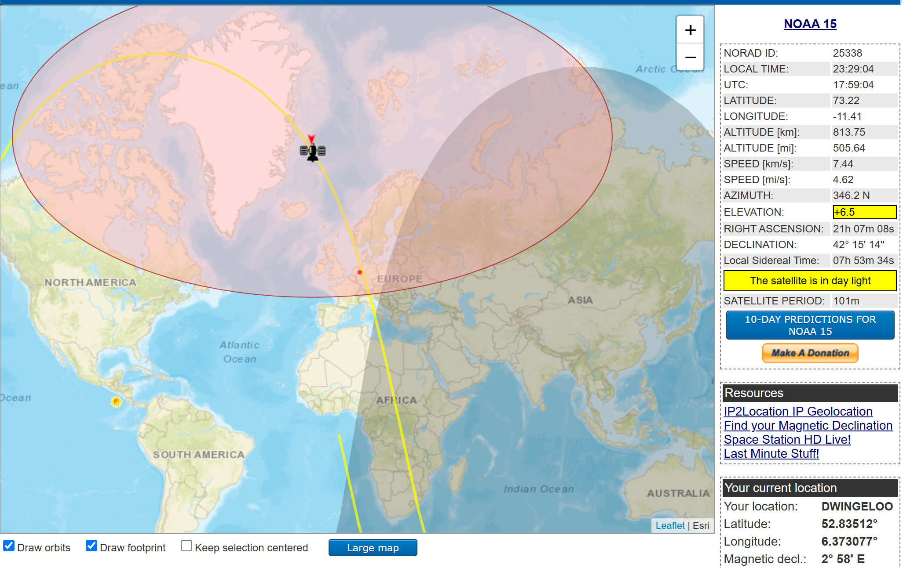
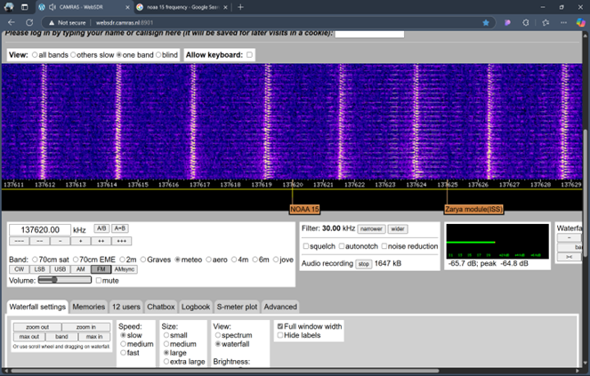
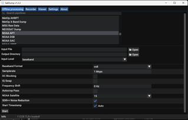

# 📡 NOAA Satellite Image Acquisition & Enhancement System  

## 🚀 Project Overview  

This project presents a complete end-to-end system for:

- 📡 Receiving NOAA weather satellite signals  
- 🔊 Decoding APT (Automatic Picture Transmission) signals  
- 🖼 Enhancing satellite imagery  
- 🧠 Reconstructing corrupted image segments  
- 🌍 Performing landmark segmentation using K-Means clustering  

The system captures real-time Earth imagery from **NOAA-15, NOAA-18, and NOAA-19** satellites using WebSDR and processes the decoded images using advanced image processing techniques in MATLAB.

## 📖 Introduction

This project focuses on receiving and processing real-time weather satellite images transmitted by NOAA-15, NOAA-18, and NOAA-19. These satellites broadcast Automatic Picture Transmission (APT) signals in the 137 MHz band, which contain Earth observation and meteorological data.

The objective of this project is to build a complete workflow for:

- Receiving NOAA APT signals using WebSDR  
- Decoding the signals into satellite images  
- Enhancing noisy images using Gaussian and Median filtering  
- Reconstructing corrupted line segments using Hough Transform  
- Segmenting land, water, clouds, and vegetation using K-Means clustering  

NOAA satellites were selected because their signals are publicly accessible, broadcast in real-time, and provide global coverage through sun-synchronous polar orbits.

This project integrates satellite communication, signal processing, image enhancement, and basic machine learning into a single practical system for Earth observation.


## 🛰️ Satellites Used  

| Satellite | Frequency (MHz) | Orbit Type | Altitude |
|------------|----------------|------------|----------|
| NOAA-15 | 137.620 | Sun-synchronous | ~870 km |
| NOAA-18 | 137.9125 | Sun-synchronous | ~854 km |
| NOAA-19 | 137.100 | Sun-synchronous | ~870 km |

These satellites broadcast real-time weather imagery via APT signals in the 137 MHz band.

---
## 📡 Signal Reception Setup

### 2.1 Satellite Tracking and Scheduling

We tracked NOAA satellite passes using online prediction tools to determine the exact time when the satellite would be overhead. This helped us record high-quality APT signals.

<br>



<br><br>

---

### 2.2 Signal Reception Setup

The analog APT signal was received using WebSDR by tuning into the 137 MHz band. The audio signal was monitored and recorded in WAV format.

<br>



<br><br>

---

### 2.3 Audio Recording and Conversion

The recorded audio was decoded using SatDump software, which converted the analog APT signal into visible satellite imagery.

<br>



<br><br>

---

### 2.4 Observations

The decoded images contained noise and horizontal distortion lines. These images were later enhanced using filtering and reconstruction techniques.

<<table>
  <tr>
    <td align="center">
      <br>
      Image 1
    </td>
    <td align="center">
      <br>
      Image 2
    </td>
  </tr>
  <tr>
    <td colspan="2" align="center">
      <br>
      Image 3
    </td>
  </tr>
</table>

## 🏗 System Workflow  

### 1️⃣ Satellite Tracking  
- Satellite passes predicted using online tracking tools  
- Recording scheduled during overhead passes  

### 2️⃣ Signal Reception  
- WebSDR used for tuning into 137 MHz frequency band  
- Audio recorded in WAV format  

### 3️⃣ Signal Decoding  
- APT signals decoded using SatDump  
- Generated grayscale satellite images  

### 4️⃣ Image Enhancement  

#### 🔹 Gaussian Filtering  
- Reduces high-frequency Gaussian noise  
- Smooths image  

#### 🔹 Median Filtering  
- Removes salt-and-pepper noise  
- Preserves edges  

---
## 🖼 Image Enhancement Using Gaussian and Median Filtering

Image enhancement improves the visual quality of decoded satellite images by reducing noise and preserving important features such as edges and boundaries.

---

### 📌 Introduction

Satellite images often contain noise due to signal distortion during transmission.  
To improve clarity, we applied two widely used filtering techniques:

- Gaussian Filtering  
- Median Filtering  

---

### 🔹 Gaussian Filtering

The Gaussian filter is used to smooth images and reduce high-frequency (Gaussian) noise.

**Key Points:**
- Reduces fine-grain noise
- Slightly smooths edges
- Controlled by standard deviation (σ)

In MATLAB:
```matlab
J = imgaussfilt(Igray, 3);
```

---

### 🔹 Median Filtering

The Median filter replaces each pixel with the median value of its neighboring pixels.

**Key Points:**
- Removes salt-and-pepper noise
- Preserves edges better than Gaussian filter
- Works well for impulsive noise

In MATLAB:
```matlab
K = medfilt2(Igray, [9 9]);
```

---

### 💻 MATLAB Implementation

```matlab
clc;
clear;
close all;

% Read image
I = imread("Satellite_raw_image.png");
Igray = rgb2gray(I);

% Gaussian Filter
J = imgaussfilt(Igray, 3);

% Median Filter
K = medfilt2(Igray, [9 9]);

figure, imshow(Igray), title('Original Image');
figure, imshow(J), title('Gaussian Filtered Image');
figure, imshow(K), title('Median Filtered Image');
```

---

### 📊 Results and Observations

- Gaussian filter reduced fine noise but slightly blurred edges.
- Median filter preserved edges while removing impulse noise.
- Combining both filters produced the best visual clarity.

<br>


<br>


<br>


<br><br>

---
## 🖼 Image Enhancement Using Gaussian and Median Filtering

Image enhancement improves the visual quality of decoded satellite images by reducing noise and preserving important features such as edges and boundaries.

---

### 📌 Introduction

Satellite images often contain noise due to signal distortion during transmission.  
To improve clarity, we applied two widely used filtering techniques:

- Gaussian Filtering  
- Median Filtering  

---

### 🔹 Gaussian Filtering

The Gaussian filter is used to smooth images and reduce high-frequency (Gaussian) noise.

**Key Points:**
- Reduces fine-grain noise
- Slightly smooths edges
- Controlled by standard deviation (σ)

In MATLAB:
```matlab
J = imgaussfilt(Igray, 3);
```

---

### 🔹 Median Filtering

The Median filter replaces each pixel with the median value of its neighboring pixels.

**Key Points:**
- Removes salt-and-pepper noise
- Preserves edges better than Gaussian filter
- Works well for impulsive noise

In MATLAB:
```matlab
K = medfilt2(Igray, [9 9]);
```

---

### 💻 MATLAB Implementation

```matlab
clc;
clear;
close all;

% Read image
I = imread("Satellite_raw_image.png");
Igray = rgb2gray(I);

% Gaussian Filter
J = imgaussfilt(Igray, 3);

% Median Filter
K = medfilt2(Igray, [9 9]);

figure, imshow(Igray), title('Original Image');
figure, imshow(J), title('Gaussian Filtered Image');
figure, imshow(K), title('Median Filtered Image');
```

---

### 📊 Results and Observations

- Gaussian filter reduced fine noise but slightly blurred edges.
- Median filter preserved edges while removing impulse noise.
- Combining both filters produced the best visual clarity.

<br>


<br>


<br>


<br><br>

---

### ✅ Conclusion

Gaussian and Median filtering significantly improved image clarity by reducing transmission noise.  
The filtered images provided a stronger foundation for further processing such as reconstruction and segmentation.

### ✅ Conclusion

Gaussian and Median filtering significantly improved image clarity by reducing transmission noise.  
The filtered images provided a stronger foundation for further processing such as reconstruction and segmentation.

## 🧱 Image Reconstruction (Hough Transform)

The Hough Transform is used to:

- Detect corrupted horizontal noise lines  
- Identify strong line structures  
- Reconstruct broken segments  
- Improve image continuity  

Techniques used:
- Canny Edge Detection  
- Hough Transform  
- Hough Peaks  
- Line Extraction  
- Morphological Operations  

---

## 🌍 Landmark Mapping Using K-Means Clustering  

K-Means clustering (k = 4) is applied to segment the satellite image into:

- 🌊 Ocean  
- 🟫 Land  
- ☁ Clouds  
- 🌿 Vegetation  

False coloring is applied for better visualization and interpretation.

---

## 🛠 Technologies & Tools Used  

- WebSDR (Signal Reception)  
- SatDump (APT Decoding)  
- MATLAB (Image Processing & Machine Learning)  
- Canny Edge Detection  
- Hough Transform  
- K-Means Clustering  

---

## 📊 Results  

✔ Successful real-time satellite image acquisition  
✔ Effective noise reduction using combined filters  
✔ Detection and reconstruction of corrupted lines  
✔ Clear segmentation of land, water, vegetation, and clouds  
✔ Hardware-free SDR-based implementation  

---

## 💡 Innovations & Uniqueness  

- ✅ Hardware-free satellite reception using WebSDR  
- ✅ Advanced post-processing beyond basic APT decoding  
- ✅ Integration of signal processing + image processing + ML  
- ✅ Cost-effective Earth observation system  

---

## 🔮 Future Scope  

- Automation of satellite tracking & decoding  
- Machine Learning-based weather classification  
- HRPT high-resolution reception  
- Georeferencing and map overlay  
- Real-time dashboard visualization  

---

## 📂 Project Structure  

```
NOAA-Satellite-Image-Enhancement/
│
├── raw_audio/
├── decoded_images/
├── filtered_images/
├── hough_reconstruction/
├── kmeans_segmentation/
├── matlab_code/
└── README.md
```

---

## 👨‍💻 Author  

**Sarvesh Kumar**  
B.Tech – Electronics & Communication Engineering  
Faculty of Technology, University of Delhi  

---

## ⭐ If You Found This Project Interesting  

Give it a ⭐ on GitHub and feel free to contribute!
